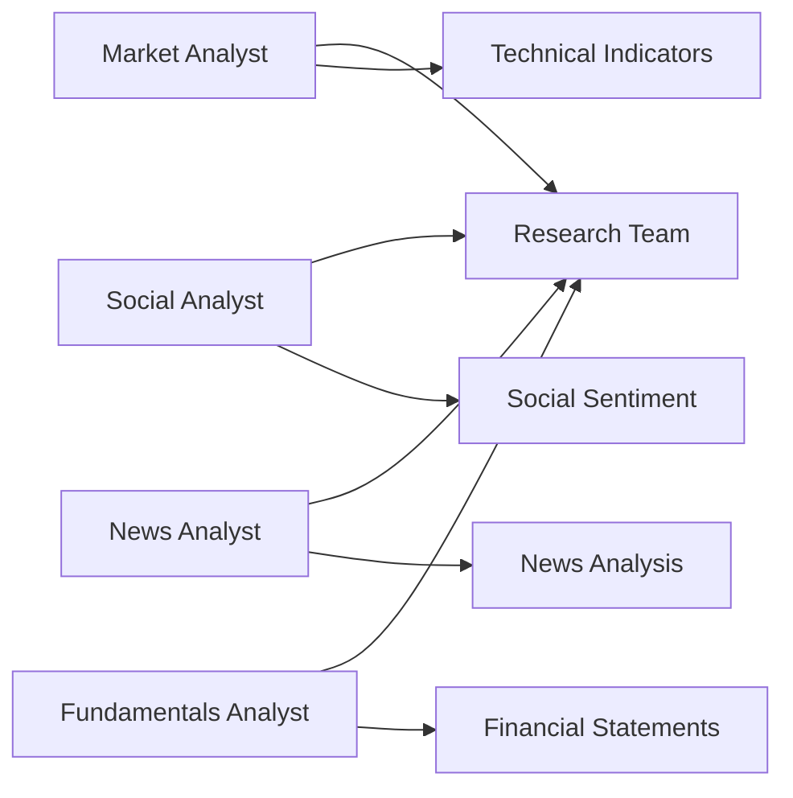
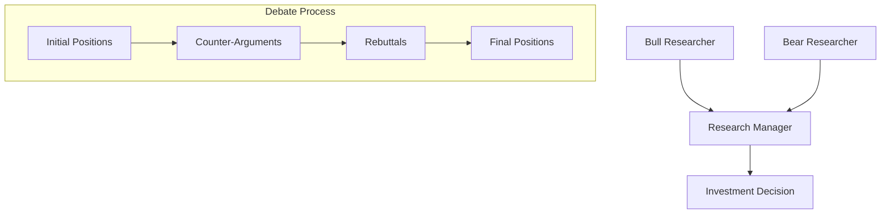
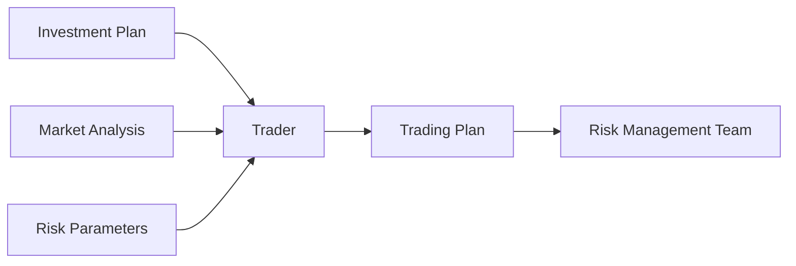
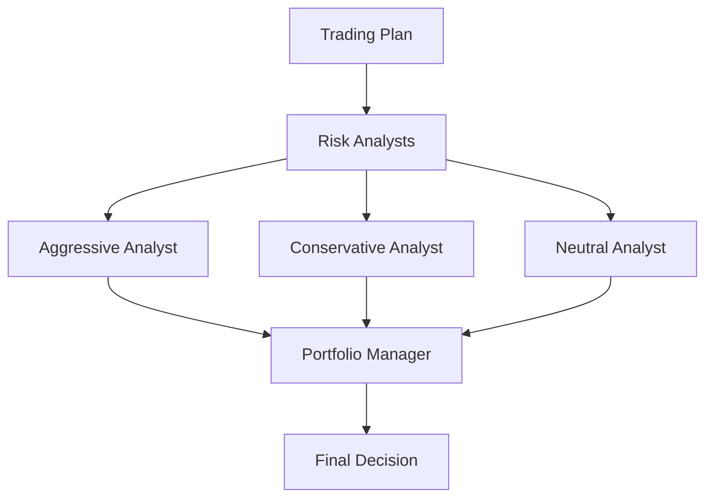

# TradingAgents Architecture Guide

This document provides a comprehensive overview of the TradingAgents system architecture, including the agent workflow, state management, and technical implementation details.

## 🏗️ System Overview

TradingAgents implements a multi-layered architecture that mirrors real-world trading firm operations:

```
┌─────────────────────────────────────────────────────────────┐
│                     CLI / Python API                        │
├─────────────────────────────────────────────────────────────┤
│                    TradingAgentsGraph                       │
├─────────────────────────────────────────────────────────────┤
│  Agent Layer: Analysts │ Researchers │ Trader │ Risk Mgmt   │
├─────────────────────────────────────────────────────────────┤
│        Graph Layer: LangGraph State Management              │
├─────────────────────────────────────────────────────────────┤
│     Data Layer: YFinance │ FinnHub │ Reddit │ Google News   │
├─────────────────────────────────────────────────────────────┤
│        Memory Layer: Agent Memory & Learning               │
└─────────────────────────────────────────────────────────────┘
```

## 🔄 Agent Workflow

### Stage 1: Analyst Team
The analysis begins with specialized analysts gathering intelligence from different data sources:



**Execution Flow:**
1. **Market Analyst**: Analyzes technical indicators (RSI, MACD, Bollinger Bands, etc.)
2. **Social Analyst**: Monitors Reddit and social media sentiment
3. **News Analyst**: Processes recent news and macroeconomic events
4. **Fundamentals Analyst**: Examines financial statements and company metrics

### Stage 2: Research Team Debate
The research team conducts structured debates to evaluate investment opportunities:



**Debate Structure:**
- **Bull Researcher**: Argues for buying/holding the asset
- **Bear Researcher**: Argues against or for selling the asset
- **Research Manager**: Moderates debate and makes final investment recommendation
- **Configurable Rounds**: Number of debate rounds can be adjusted (default: 1)

### Stage 3: Trader Execution
The trader creates detailed execution plans based on research insights:



### Stage 4: Risk Management Team
Multiple risk analysts evaluate the trading plan from different perspectives:



### Stage 5: Portfolio Management
The portfolio manager makes the final approval/rejection decision:

- Reviews all risk assessments
- Makes final go/no-go decision
- Considers portfolio-wide implications

## 🧠 State Management

### AgentState Structure
The system uses a comprehensive state object to track information across agents:

```python
class AgentState(MessagesState):
    # Basic Information
    company_of_interest: str      # Target company ticker
    trade_date: str              # Analysis date
    sender: str                  # Current agent identifier
    
    # Analyst Reports
    market_report: str           # Technical analysis
    sentiment_report: str        # Social sentiment analysis
    news_report: str            # News and macro analysis
    fundamentals_report: str     # Financial statement analysis
    
    # Research Team Outputs
    investment_debate_state: InvestDebateState  # Debate progress
    investment_plan: str         # Final research recommendation
    
    # Trading Team Outputs
    trader_investment_plan: str  # Detailed trading plan
    
    # Risk Management Outputs
    risk_debate_state: RiskDebateState  # Risk evaluation progress
    final_trade_decision: str    # Portfolio manager decision
```

### Debate State Management
The system tracks debate progress for both research and risk management teams:

```python
class InvestDebateState:
    history: str               # Complete debate history
    bull_history: str         # Bull researcher contributions
    bear_history: str         # Bear researcher contributions
    judge_decision: str       # Research manager final decision
    count: int               # Current debate round

class RiskDebateState:
    risky_history: str        # Aggressive analyst contributions
    safe_history: str         # Conservative analyst contributions
    neutral_history: str      # Neutral analyst contributions
    judge_decision: str       # Portfolio manager decision
    count: int               # Current evaluation round
```

## 🔧 Technical Implementation

### LangGraph Integration
The system uses LangGraph for agent orchestration:

```python
# Graph setup with conditional logic
workflow = StateGraph(AgentState)

# Add analyst nodes
workflow.add_node("Market Analyst", market_analyst_node)
workflow.add_node("Social Analyst", social_analyst_node)
# ... other agents

# Define conditional edges
workflow.add_conditional_edges(
    "Market Analyst",
    should_continue_to_social,
    {"continue": "Social Analyst", "end": END}
)
```

### Memory System
Each agent type has persistent memory for learning and consistency:

```python
class FinancialSituationMemory:
    def __init__(self, name: str, config: Dict):
        self.name = name
        self.embeddings = self._init_embeddings(config)
        self.vector_store = Chroma(
            collection_name=name,
            embedding_function=self.embeddings
        )
    
    def get_memories(self, situation: str, n_matches: int = 2):
        # Retrieve relevant past experiences
        return self.vector_store.similarity_search(situation, k=n_matches)
```

### Tool Integration
Agents have access to specialized tools for data retrieval:

```python
class Toolkit:
    def get_YFin_data(self, ticker, start_date, end_date):
        # Yahoo Finance data retrieval
    
    def get_finnhub_news(self, ticker, date, lookback_days):
        # News data from FinnHub
    
    def get_stockstats_indicators_report(self, ticker, indicators, date):
        # Technical indicator calculations
    
    def get_reddit_sentiment(self, ticker, date):
        # Social media sentiment analysis
```

## 🔀 Conditional Logic

The system implements sophisticated conditional logic for agent transitions:

```python
class ConditionalLogic:
    def should_continue_analysis(self, state):
        # Determine if more analysts needed
        
    def should_start_debate(self, state):
        # Check if ready for research team debate
        
    def should_continue_debate(self, state):
        # Determine if debate should continue
        
    def should_proceed_to_risk(self, state):
        # Check if ready for risk management
```

## 📊 Data Flow

### Data Source Integration
The system integrates multiple data sources through a unified interface:

```
External APIs          Data Processing        Agent Consumption
┌─────────────┐       ┌────────────────┐     ┌──────────────┐
│ Yahoo Finance│ ───►  │ YFin Utils     │ ──► │ Market       │
│ FinnHub     │ ───►  │ FinnHub Utils  │ ──► │ Analysts     │
│ Reddit      │ ───►  │ Reddit Utils   │ ──► │              │
│ Google News │ ───►  │ News Utils     │ ──► │              │
└─────────────┘       └────────────────┘     └──────────────┘
```

### Caching Strategy
- **Online Mode**: Real-time data fetching with local caching
- **Offline Mode**: Pre-cached data for consistent backtesting
- **Hybrid Mode**: Combines cached and real-time data as needed

## 🔄 Error Handling & Recovery

### Agent Failure Recovery
```python
def handle_agent_failure(agent_name, error, state):
    # Log error details
    # Attempt agent restart
    # Fall back to simplified analysis if needed
    # Continue workflow with available data
```

### Data Unavailability
- Graceful degradation when data sources are unavailable
- Alternative data source fallbacks
- Clear indication of missing data in reports

## ⚡ Performance Considerations

### Parallel Execution
- Analyst agents can run in parallel when data dependencies allow
- Tool calls are batched where possible
- Memory operations are optimized for frequent access

### Token Management
- Efficient prompt engineering to minimize token usage
- Context window management for long debates
- Selective information passing between agents

### Scalability
- Modular agent design allows easy addition of new agent types
- Configurable debate rounds and analysis depth
- Resource usage scales with selected analyst types

## 🔧 Configuration Points

### Agent Selection
```python
selected_analysts = ["market", "social", "news", "fundamentals"]
# Flexible analyst team composition
```

### LLM Configuration
```python
config = {
    "llm_provider": "openai",           # openai, anthropic, google, ollama
    "deep_think_llm": "o1-preview",     # For complex reasoning
    "quick_think_llm": "gpt-4o-mini",   # For routine tasks
    "backend_url": "https://api.openai.com/v1"
}
```

### Debate Tuning
```python
config = {
    "max_debate_rounds": 3,          # Research team debate rounds
    "max_risk_discuss_rounds": 2,    # Risk evaluation rounds
    "online_tools": True             # Real-time vs cached data
}
```

This architecture provides a robust, scalable foundation for multi-agent financial analysis while maintaining flexibility for research and customization. 